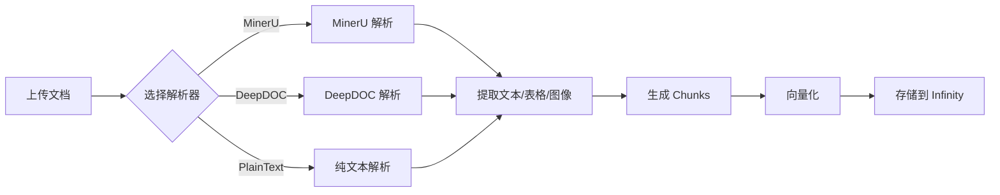

# MinerU 解析器使用指南

## 📚 简介

MinerU 是 RAGFlow v0.21.0 新增的高级文档解析器，提供更强大的文档解析能力。本指南将帮助您在 RAGFlow 中启用和使用 MinerU 解析器。

---

## ✨ 功能特点

- 🚀 **更强大的解析能力**：相比 DeepDOC，MinerU 提供更精确的文档结构识别
- 📄 **支持复杂文档**：更好地处理复杂的 PDF 文档布局
- 🎯 **高精度提取**：提高文本、表格和图像的提取质量
- 🔧 **可配置输出**：支持自定义输出目录和清理策略

---

## 🔧 配置步骤

### 1. 安装 MinerU

首先需要在 RAGFlow 容器中安装 MinerU：

```bash
# 进入 RAGFlow 容器
docker exec -it ragflow-server bash

# 安装 MinerU（具体安装方式取决于 MinerU 的发布形式）
pip install mineru  # 或者按照 MinerU 官方文档安装
```

### 2. 配置环境变量

在 `docker/.env` 文件中添加 MinerU 相关配置：

```bash
# MinerU 可执行文件路径（默认：mineru）
MINERU_EXECUTABLE=mineru

# MinerU 输出目录（可选）
MINERU_OUTPUT_DIR=/tmp/mineru_output

# 是否在处理后删除 MinerU 输出文件（默认：1=删除）
MINERU_DELETE_OUTPUT=1
```

### 3. 重启服务

```bash
cd /home/ubuntu/ragflow/docker
docker-compose restart ragflow-server
```

---

## 🎯 使用方法

### 方法一：通过前端界面（推荐）

1. **创建或编辑知识库**
   - 进入知识库页面
   - 点击"创建知识库"或编辑现有知识库

2. **选择 MinerU 解析器**
   - 在"解析设置"部分
   - 找到"布局识别"(Layout Recognize) 下拉菜单
   - 选择 **MinerU** 选项

3. **上传文档**
   - 上传您的 PDF 或其他支持的文档格式
   - RAGFlow 将自动使用 MinerU 进行解析

### 方法二：通过 API

```bash
# 创建知识库时指定 MinerU
curl -X POST "http://localhost:9380/api/v1/kb/create" \
  -H "Content-Type: application/json" \
  -H "Authorization: Bearer YOUR_TOKEN" \
  -d '{
    "name": "测试知识库",
    "parser_config": {
      "layout_recognize": "MinerU",
      "chunk_token_num": 512
    }
  }'
```

### 方法三：直接修改数据库（高级）

```sql
-- 更新现有知识库使用 MinerU
UPDATE knowledgebase 
SET parser_config = JSON_SET(
  parser_config, 
  '$.layout_recognize', 
  'MinerU'
)
WHERE id = 'YOUR_KB_ID';
```

---

## 📊 选项对比

| 特性 | DeepDOC | MinerU | Plain Text |
|------|---------|--------|------------|
| 文档布局识别 | ✅ 好 | ✅✅ 优秀 | ❌ 无 |
| 表格提取 | ✅ 支持 | ✅✅ 高精度 | ❌ 不支持 |
| 图像处理 | ✅ 支持 | ✅✅ 增强 | ❌ 不支持 |
| 处理速度 | ⚡ 快 | ⚡ 中等 | ⚡⚡ 最快 |
| 资源消耗 | 💻 中等 | 💻💻 较高 | 💻 最低 |
| 适用场景 | 一般文档 | 复杂文档 | 纯文本 |

---

## 🚀 性能优化建议

### 1. 批处理设置

对于大量文档，调整批处理参数以优化性能：

```bash
# docker/.env
DOC_BULK_SIZE=4          # MinerU 推荐使用较小的批处理大小
EMBEDDING_BATCH_SIZE=16  # 根据服务器性能调整
```

### 2. 输出管理

```bash
# 自动清理输出（节省磁盘空间）
MINERU_DELETE_OUTPUT=1

# 或保留输出用于调试
MINERU_DELETE_OUTPUT=0
MINERU_OUTPUT_DIR=/data/mineru_debug
```

### 3. 内存配置

确保 Docker 容器有足够的内存：

```bash
# docker/.env
MEM_LIMIT=8589934592  # 8GB，MinerU 可能需要更多内存
```

---

## ⚠️ 常见问题

### Q1: 选择 MinerU 后解析失败？

**A:** 检查以下几点：

1. **MinerU 是否已安装**：
   ```bash
   docker exec ragflow-server which mineru
   docker exec ragflow-server mineru --version
   ```

2. **查看错误日志**：
   ```bash
   docker logs ragflow-server | grep -i mineru
   ```

3. **环境变量是否正确**：
   ```bash
   docker exec ragflow-server env | grep MINERU
   ```

### Q2: MinerU 解析速度很慢？

**A:** MinerU 比 DeepDOC 更耗资源，这是正常现象。优化建议：

- 减少 `DOC_BULK_SIZE` 值
- 增加容器内存限制
- 考虑只对重要文档使用 MinerU

### Q3: 如何查看 MinerU 输出？

**A:** 设置保留输出目录：

```bash
# docker/.env
MINERU_DELETE_OUTPUT=0
MINERU_OUTPUT_DIR=/ragflow/data/mineru_output
```

然后查看：
```bash
docker exec ragflow-server ls -la /ragflow/data/mineru_output
```

### Q4: 前端没有 MinerU 选项？

**A:** 确保：

1. 已经更新到最新版本的代码
2. 前端已重新构建：
   ```bash
   docker-compose restart ragflow-server
   ```
3. 清除浏览器缓存并刷新页面

---

## 📝 使用示例

### 示例 1：解析学术论文

```python
# 使用 Python SDK
from ragflow import RAGFlow

client = RAGFlow(api_key="YOUR_API_KEY", base_url="http://localhost:9380")

# 创建使用 MinerU 的知识库
kb = client.create_kb(
    name="学术论文库",
    parser_config={
        "layout_recognize": "MinerU",
        "chunk_token_num": 1024,  # 学术论文可以使用更大的 chunk
        "auto_keywords": 5,
        "auto_questions": 3
    }
)

# 上传论文
kb.upload_document("research_paper.pdf")
```

### 示例 2：批量处理技术文档

```python
import os
from ragflow import RAGFlow

client = RAGFlow(api_key="YOUR_API_KEY", base_url="http://localhost:9380")

# 创建技术文档知识库
kb = client.create_kb(
    name="技术文档库",
    parser_config={
        "layout_recognize": "MinerU",
        "chunk_token_num": 512,
        "toc_extraction": True  # 提取目录结构
    }
)

# 批量上传文档
docs_dir = "/path/to/technical/docs"
for filename in os.listdir(docs_dir):
    if filename.endswith(".pdf"):
        filepath = os.path.join(docs_dir, filename)
        print(f"Uploading {filename}...")
        kb.upload_document(filepath)
```

---

## 🔍 验证 MinerU 是否工作

### 1. 查看日志

```bash
# 实时查看解析日志
docker logs -f ragflow-server | grep -E "MinerU|mineru"
```

成功的日志示例：
```
2025-10-17 10:00:00,123 INFO MinerU Detected version: 1.0.0
2025-10-17 10:00:01,456 INFO Parsing with MinerU: document.pdf
2025-10-17 10:00:15,789 INFO MinerU parsing completed: 15 pages processed
```

### 2. 检查数据库

```sql
-- 查看使用 MinerU 的知识库
SELECT id, name, parser_config->>'$.layout_recognize' as parser
FROM knowledgebase
WHERE parser_config->>'$.layout_recognize' = 'MinerU';
```

### 3. 测试解析质量

上传一个包含复杂表格和图像的 PDF，然后：

1. 查看解析后的 chunks
2. 验证表格内容是否正确提取
3. 检查图像描述是否生成
4. 测试检索结果的准确性

---

## 📚 技术细节

### 后端实现

MinerU 解析器在以下文件中实现：

- **解析器核心**：`deepdoc/parser/mineru_parser.py`
- **集成逻辑**：`rag/app/naive.py`
- **前端组件**：`web/src/components/layout-recognize*.tsx`

### 工作流程



### 环境变量详解

| 变量名 | 类型 | 默认值 | 说明 |
|--------|------|--------|------|
| `MINERU_EXECUTABLE` | String | `mineru` | MinerU 可执行文件路径 |
| `MINERU_OUTPUT_DIR` | String | `""` | 输出目录，空字符串表示临时目录 |
| `MINERU_DELETE_OUTPUT` | Boolean | `1` | 处理后是否删除输出（1=删除，0=保留）|

---

## 🎓 最佳实践

### 1. 根据文档类型选择解析器

- **简单文本文档**：Plain Text（最快）
- **一般 PDF 文档**：DeepDOC（平衡）
- **复杂技术文档**：MinerU（最佳质量）
- **包含复杂表格的报告**：MinerU（推荐）

### 2. 混合使用策略

```python
# 为不同类型的文档创建不同的知识库
simple_docs_kb = client.create_kb(
    name="简单文档",
    parser_config={"layout_recognize": "Plain Text"}
)

complex_docs_kb = client.create_kb(
    name="复杂文档",
    parser_config={"layout_recognize": "MinerU"}
)
```

### 3. 监控和调优

定期检查：
- 解析成功率
- 解析时间
- 检索准确度
- 资源使用情况

根据结果调整解析器选择和参数配置。

---

## 🔗 相关资源

- [RAGFlow 官方文档](https://ragflow.io/docs)
- [MinerU 项目地址](https://github.com/opendatalab/MinerU)（如果公开）
- [Agent 组件参考](../docs/guides/agent/agent_component_reference/parser.md)
- [更新日志](../CHANGELOG_myproject.md)

---

## 📞 支持

如遇问题：

1. 查看日志：`docker logs ragflow-server`
2. 检查 [FAQ](#common-issues)
3. 提交 Issue 到项目仓库

---

**更新时间**：2025-10-17  
**版本**：v0.21.0-custom  
**作者**：MyProject Team
